```mermaid
graph TD

    subgraph "SettleJobConfiguration"
        A[settleJob 시작] --> B[preSettleDetailStep 실행]
        B --> C[settleDetailStep 실행]
        C --> D[isFridayDecider 결정자 실행]
        D --> |"금요일이면"| E[settleGroupStep 실행]
        D --> |"금요일이 아니면"| F[settleJob 종료]
        E --> F[settleJob 종료]
    end

    subgraph "PreSettleDetail"
        G[ApiOrder 데이터 읽기] --> H[PreSettleDetailProcessor 처리]
        H --> I[PreSettleDetailWriter로 데이터 저장]
    end

    subgraph "SettleDetailStep"
        J[KeyAndCount 데이터 읽기] --> K[SettleDetailProcessor 처리]
        K --> L[JPA로 SettleDetail 데이터 저장]
    end

    subgraph "SettleGroupStep"
        M[Customer 데이터 읽기] --> N[SettleGroupProcessor 처리]
        N --> O[DB와 Mail로 SettleGroup 데이터 저장]
    end

```

### 1. SettleJobConfiguration

'settleJob'은 배치 작업을 정의한다. 이 작업은 정산 과정의 전반적인 흐름을 설정한다.
- isFridayDecider(): 이 함수는 금요일 여부를 판단하는 결정자로 사용한다. 금요일일 경우 주간 정산을 진행한다.

### 2. PreSettleDetail
이 클래스는 파일에서 ApiOrder 데이터를 읽어온다. 그 후, 실패하지 않은 주문의 고객과 서비스를 Key로 집계한다.
- PreSettleDetailProcessor: 이 프로세서는 주어진 ApiOrder에서 Key를 추출한다.
- PreSettleDetailWriter: 이 Writer는 Key를 기준으로 데이터를 집계했고, 그 결과를 ExecutionContext의 'snapshots'에 저장한다.

### 3. SettleDetailStep
이 단계에서는 'snapshots'에 저장된 집계 데이터를 가져와 SettleDetail 객체로 변환한다. 그리고 그 데이터를 DB에 저장한다.
- SettleDetailProcessor: 이 프로세서는 KeyAndCount를 SettleDetail로 변환하는 작업을 진행한다.
- SettleDetailReader: 이 Reader는 'snapshots'에서 KeyAndCount 객체를 읽어온다.

### 4. SettleGroupStep
이 단계에서는 고객별 정산 정보를 그룹화한다. 그리고 그 정보를 DB에 저장하고 이메일로도 전송한다.
- SettleGroupProcessor: 이 프로세서는 주어진 Customer에 대한 SettleGroup을 생성한다.
- SettleGroupReader: 이 Reader는 DB에서 고객 정보를 가져온다.
- SettleGroupItemDBWriter: 이 Writer는 생성된 SettleGroup을 DB에 저장한다.

