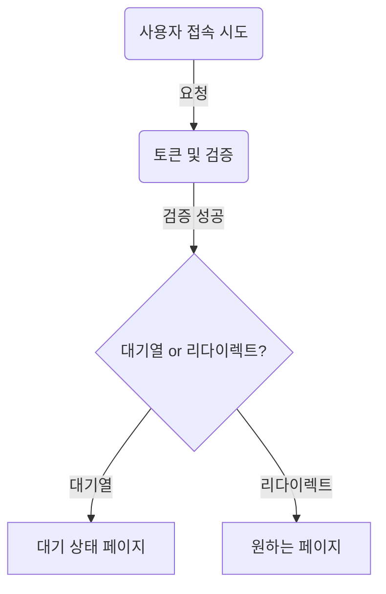
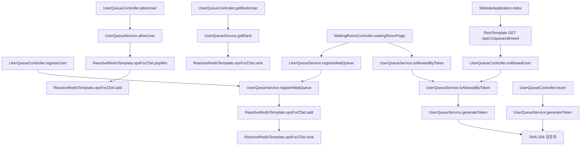

0. 목차
1. 프로젝트 소개
   - 소개
   - 사용 기술 스택
2. API
3. 프로젝트 구조
   - 패키지 구조
   - 데이터 흐름
   - 주요 클래스 설명


# 1.  프로젝트 소개

## 소개
Spring Webflux와 Reactive Redis를 실습하기 위한 MVP 프로젝트이다. 어플리케이션은 접속자 대기열 시스템과 타깃 페이지 시스템으로 나뉜다. 
- 코드 및 자료 출처는 패스트캠퍼스 시그니처 백엔드 패키지 course 7이다.

## 사용 기술 스택

- **Spring Webflux**: 5.3.14
- **Reactive Redis**: 2.6.1
- **Spring Boot**: 3.0.9
- **Java**: JDK 17
- **Gradle**: 7.3
- **Thymeleaf**: 3.0.14
- **JUnit**: 5.8.2
- **Docker**:  20.10.10

# 2. API

## Localhost:9010

- `/api/v1/queue`
    - `POST /?queue={queue_name}&user_id={user_id}`: 사용자를 대기열에 등록
        - `queue_name`: 대기열 이름, 기본값은 'default'
        - `user_id`: 사용자 ID
    - `POST /allow?queue={queue_name}&count={count}`: 특정 수의 사용자를 대기열에서 제거하고 접근을 허용
        - `queue_name`: 대기열 이름, 기본값은 'default'
        - `count`: 접근을 허용할 사용자 수
    - `GET /allowed?queue={queue_name}&user_id={user_id}&token={token}`: 특정 사용자가 접근이 허용되었는지 확인
        - `queue_name`: 대기열 이름, 기본값은 'default'
        - `user_id`: 사용자 ID
        - `token`: 인증 토큰
    - `GET /rank?queue={queue_name}&user_id={user_id}`: 특정 사용자의 대기열 순위를 확인
        - `queue_name`: 대기열 이름, 기본값은 'default'
        - `user_id`: 사용자 ID
    - `GET /touch?queue={queue_name}&user_id={user_id}`: 사용자에게 토큰을 발급하고 쿠키에 저장
        - `queue_name`: 대기열 이름, 기본값은 'default'
        - `user_id`: 사용자 ID

- `/waiting-room`
    - `GET /waiting-room?queue={queue_name}&user_id={user_id}&redirect_url={redirect_url}`: 대기 웹페이지를 렌더링
        - `queue_name`: 대기열 이름, 기본값은 'default'
        - `user_id`: 사용자 ID
        - `redirect_url`: 대기가 완료된 후 리다이렉션될 URL, 기본값은 'http://localhost:9000'

## Localhost:9000

- `/`
    - `GET /?queue={queue_name}&user_id={user_id}`: 타겟 페이지. 여기로 리다이렉션될 경우, 대기가 완료된 것
        - `queue_name`: 대기열 이름, 기본값은 'default'
        - `user_id`: 사용자 ID


# 3. 프로젝트 구조

## 패키지 구조

### 접속자 대기열 시스템
대용량 트래픽을 처리하는 접속자 대기열 시스템으로 `UserQueueController`, `WaitingRoomController`, 그리고 `UserQueueService` 클래스를 중심으로 구현되어 있다.

- `UserQueueController`: API를 통해 대기열에 유저를 등록하거나 특정 수의 유저를 허용한다.
- `WaitingRoomController`: 대기 중인 유저를 대기실 페이지로 리다이렉트한다.
- `UserQueueService`: 대기열 로직을 처리합니다. 이 클래스에서는 Redis를 활용해 대기열을 관리한다.


```
├── main
│   ├── java
│   │   ├── com
│   │   │   └── yourpackage
│   │   │       ├── controller
│   │   │       │   ├── UserQueueController.java
│   │   │       │   └── WaitingRoomController.java
│   │   │       ├── service
│   │   │       │   └── UserQueueService.java
│   │   │       └── WebsiteApplication.java
│   ├── resources
│   │   ├── templates
│   │   │   └── waiting-room.html
│   │   └── application.properties
└── test

```


### 타깃 페이지
간단하게 `WebsiteApplication` 클래스 하나로 구성되어 있다. 대기가 끝난 사용자를 타겟 웹페이지로 리다이렉트한다. 이 클래스는 토큰을 기반으로 사용자가 허용되었는지 확인 후, 허용된 사용자는 타깃 페이지로, 그렇지 않은 사용자는 대기실로 리다이렉트한다.

각 페이지는 Thymeleaf 템플릿을 사용하여 렌더링되며, 대기 상태나 허용 상태에 따라 다른 내용을 보여준다.

`AllowedUserResponse` 레코드는 타겟 페이지에 접속이 허용된 사용자를 확인하기 위해 사용된다.


## 데이터 흐름

1. 사용자가 타겟 웹페이지에 접근을 시도한다.
2. 서버는 사용자의 토큰과 기타 필요한 검증절차를 거친다.
3. 검증 이후, 사용자가 대기열에 들어가야 하는지, 아니면 바로 원하는 페이지로 리다이렉트될 수 있는지를 판단한다.
    - 대기열 진입: 사용자는 대기 상태 페이지에 머무른다.
    - 리다이렉트: 사용자는 원하는 페이지로 바로 이동한다.





## 주요 클래스 설명

### 대기열 시스템 

#### `UserQueueController`

이 클래스는 대기열 관련 API를 제공한다. 사용자 등록, 사용자 허용, 대기 순위 조회 등의 엔드포인트를 가진다.

- `registerUser`: 대기열에 사용자를 등록.
- `allowUser`: 지정한 수의 사용자를 대기열에서 허용 상태로 변경.
- `isAllowedUser`: 사용자가 허용 상태인지 확인.
- `getRankUser`: 사용자의 대기 순위를 조회.
- `touch`: 대기 상태를 유지하기 위한 토큰을 생성.

#### `WaitingRoomController`

웹 페이지와 연동하여 대기 상태를 보여주는 컨트롤러.

- `waitingRoomPage`: 대기 상태를 보여주는 뷰를 렌더링한다.

#### `UserQueueService`

대기열의 핵심 로직을 처리하는 서비스 클래스.

- `registerWaitQueue`: 대기열에 사용자를 등록하고 대기 순위를 반환한다.
- `allowUser`: 지정한 수의 사용자를 대기열에서 허용 상태로 변경한다.
- `isAllowedByToken`: 토큰을 사용하여 사용자가 허용 상태인지 확인한다.
- `getRank`: 사용자의 대기 순위를 조회한다.
- `generateToken`: 대기 상태를 유지하기 위한 토큰을 생성한다.
- `scheduleAllowUser`: 주기적으로 대기 상태의 사용자를 허용 상태로 변경하는 스케쥴링 메소드.

### 타깃 페이지 

#### `WebsiteApplication`

어플리케이션의 진입점이자 타겟 웹 페이지와 대기열 로직을 연결하는 컨트롤러이다.

- `index`: 타겟 웹페이지를 렌더링하거나 대기 상태가 아니라면 대기 페이지로 리다이렉트한다.

